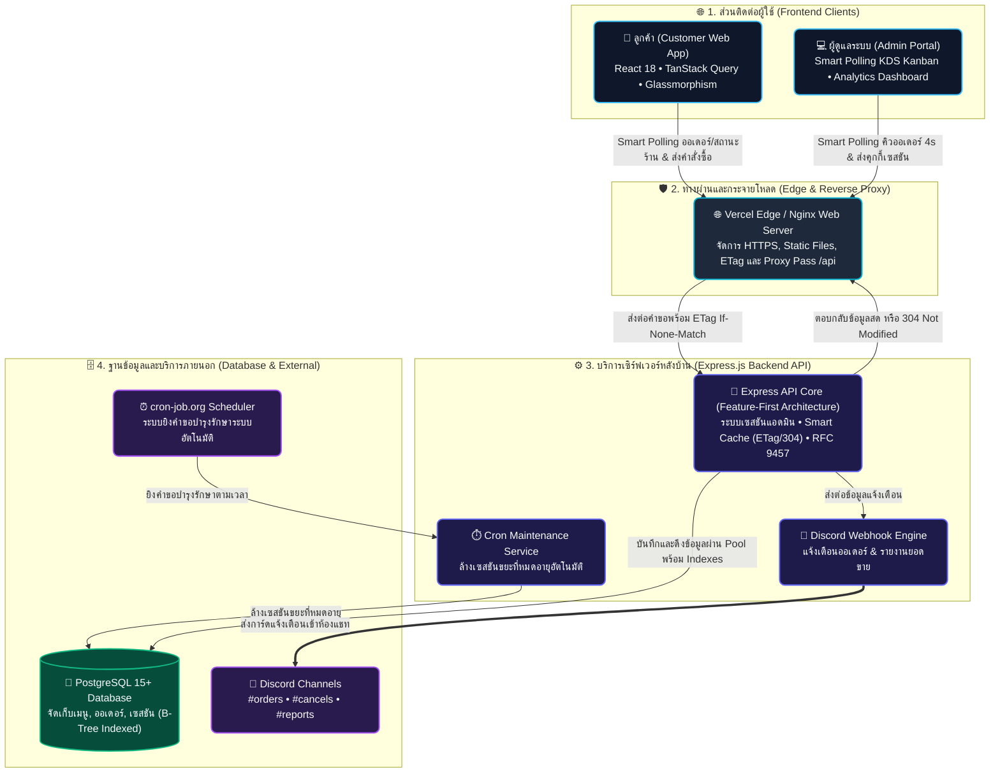

<div align="center">
  <h1>🥗 ระบบสั่งอาหารออนไลน์ (Spring Roll Online Store)</h1>
  <p><strong>เว็บแอปพลิเคชันสั่งซื้ออาหารออนไลน์ระดับ Production สไตล์ Glassmorphism สำหรับร้านสปริงโรลและอาหารเพื่อสุขภาพ ออกแบบตามสถาปัตยกรรมแบบ Feature-First, ซิงค์ข้อมูลเรียลไทม์ผ่าน Smart Polling + Smart Cache (HTTP 304 ETag), ระบบตะกร้าสินค้าแบบ Optimistic UI, การแจ้งเตือนและส่งรายงานอัตโนมัติผ่าน Discord Webhook พร้อมรองรับการ Deploy บน Cloud แบบฟรี 100%</strong></p>

  <br />

  
  
  
  
  
  
  
</div>

<br />

> [!NOTE]  
> พัฒนาตามหลักการ **Separation of Concerns (SoC)**, สถาปัตยกรรม **Feature-First** และมาตรฐานความปลอดภัย **OWASP Security Best Practices** รองรับทั้งการรันผ่าน **Docker Compose** ในเครื่อง หรือ Deploy ขึ้นระบบ Cloud ระดับ Production / Free Tier

---

## 📐 สถาปัตยกรรมระบบ (System Architecture)



---

## 🌟 จุดเด่นและฟีเจอร์สำคัญของระบบ (Key Features)

### 🛍️ ฝั่งลูกค้าร้านค้า (Customer Storefront)
- **ดีไซน์ระดับพรีเมียม (Glassmorphism & Fluid Typography)**: รองรับการใช้งานอย่างลื่นไหลบนทุกขนาดหน้าจอ ทั้งมือถือ แท็บเล็ต และคอมพิวเตอร์
- **การเลือกน้ำสลัดที่ยืดหยุ่น (Dressing Selection)**: สามารถเลือกน้ำสลัดที่ต้องการ หรือเลือกตัวเลือก "ไม่รับน้ำสลัด" ได้อย่างอิสระ
- **ตะกร้าสินค้าตอบสนองทันที (Optimistic UI & 500ms Debounce)**: ปรับจำนวนสินค้าได้ทันทีโดยไม่ต้องรอโหลด พร้อมการหน่วงเวลาส่งข้อมูลเพื่อประหยัดทรัพยากร
- **การติดตามคำสั่งซื้ออัจฉริยะ (Smart Polling Auto-Track)**: ดึงข้อมูลออเดอร์ล่าสุดของลูกค้ามาแสดงผลทันที 0 คลิก พร้อมแถบสถานะภาพ 5 สเต็ป ซิงค์ทุก 4 วินาที และหยุดอัตโนมัติเมื่อออเดอร์เสร็จสิ้น
- **การแจ้งเตือนด้วยเสียง (Harmonic Bell Chime)**: เสียงแจ้งเตือนนุ่มนวลผ่าน Web Audio Context API เมื่อสถานะออเดอร์มีการเปลี่ยนแปลง
- **สลิปคำสั่งซื้ออิเล็กทรอนิกส์ (E-Receipt)**: หน้าต่างสรุปสลิปคำสั่งซื้ออย่างเป็นทางการ พร้อมเงื่อนไขแสดงค่าจัดส่งที่ถูกต้องตามรูปแบบการรับอาหาร

### ⚙️ ฝั่งผู้ดูแลระบบ (Admin Management Portal)
- **กระดานจัดการออเดอร์แบบสด (Smart Polling KDS Kanban & Table View)**: อัปเดตออเดอร์เข้าใหม่ทุก 4 วินาที พร้อมระบบหยุด Polling อัตโนมัติเมื่อยุบจอเพื่อประหยัดทรัพยากร
- **แดชบอร์ดสถิติและยอดขาย (Analytics Dashboard)**: แสดงสรุปยอดขายวันนี้/เดือนนี้/ทั้งหมด, อัตราการยกเลิก และเมนูขายดี 5 อันดับแรก พร้อมซิงค์ทุก 15 วินาที
- **ระบบจัดการเมนูและน้ำสลัด (Full Menu & Dressing CRUD)**: เพิ่ม ลบ แก้ไข รายการอาหาร รูปภาพ ราคา และสถานะเปิด/ปิดจำหน่าย
- **การเปิด/ปิดร้านและข้อความประกาศ (Store Settings)**: สลับสถานะร้านและพิมพ์ประกาศเพื่อส่งต่อข้อมูลไปยังหน้าร้านลูกค้าแบบเรียลไทม์ทันที
- **การปิดรอบและรีเซ็ตคิวประจำวัน (Daily Closing & Reset Queue)**: ส่งสรุปยอดขายเข้า Discord ทันทีเมื่อปิดร้าน พร้อมรีเซ็ตลำดับคิวใหม่อัตโนมัติ

### 🤖 ระบบแจ้งเตือน Discord Webhook อัตโนมัติ
- **ใบแจ้งเตือนออเดอร์ใหม่**: ส่งการ์ด Embed แสดงรายการอาหาร, น้ำสลัด, ยอดเงิน, รูปแบบการจัดส่ง และเบอร์โทรลูกค้าเข้าห้อง Discord ทันที
- **การจัดการเมื่อมีการยกเลิกออเดอร์**: แก้ไขข้อความเดิมพร้อมสั่งลบข้อความเก่าภายใน 5 วินาที และส่งแจ้งเตือนการยกเลิกใหม่เพื่อป้องกันครัวทำอาหารซ้ำ
- **รายงานสรุปยอดขายประจำวัน**: สรุปยอดขายรวม, จำนวนออเดอร์สำเร็จ/ยกเลิก และเมนูขายดีประจำวัน ส่งเข้า Discord อัตโนมัติเมื่อปิดร้าน

---

## 🛡️ มาตรฐานความปลอดภัยและการเพิ่มประสิทธิภาพ (Security & Optimization)

### 🔒 ด้านความปลอดภัย (Cyber Security)
- **มาตรฐาน RFC 9457 Problem Details**: ดักจับและจัดการ Error ส่วนกลางด้วย `globalErrorHandler` พร้อมซ่อน Stack Trace บนสภาพแวดล้อม Production
- **การตรวจสอบสิทธิ์ด้วยเซสชัน (Session Auth)**: ตรวจสอบสิทธิ์แอดมินผ่านคุกกี้ที่ปลอดภัย `HttpOnly` และ `SameSite` ป้องกันการโจมตีแบบ XSS
- **การจำกัดอัตราคำขอที่เข้มงวด (Strict Rate Limits)**:
  - `POST /api/admin/login`: จำกัด 5 ครั้ง / 15 นาที (ป้องกัน Brute Force)
  - `POST /internal/cron/*`: จำกัด 20 ครั้ง / 15 นาที พร้อมตรวจสอบ `CRON_SECRET`
  - `GET /api/orders/track/:order_number`: จำกัด 300 ครั้ง / 15 นาที (รองรับ Customer Smart Polling)
  - `/api/store/*`: จำกัด 300 ครั้ง / 15 นาที (รองรับ Store Status Polling)
  - `/api/*` ทั่วไป: จำกัด 600 ครั้ง / 15 นาที (ป้องกัน DoS และ Scraper)
- **Header ความปลอดภัยและ CORS**: ติดตั้ง `Helmet` และจำกัด `CORS_ORIGIN` เฉพาะ Whitelist Domains ในโหมด Production
- **คำสั่ง SQL ปลอดภัย 100%**: ใช้ Parameterized Queries (`$1, $2, ...`) ทุกจุด ป้องกัน SQL Injection อย่างสมบูรณ์

### 🚀 ด้านการเพิ่มประสิทธิภาพและการจัดการแคช (Optimization & Caching Strategy)
- **สถาปัตยกรรม Smart Polling & Intelligent Cache (HTTP 304 + TanStack Query)**:
  - **Dynamic API Smart Caching**: เซิร์ฟเวอร์เปิดใช้งาน `ETag` (Strong ETag) เมื่อไคลเอนต์ส่งคำขอ Polling พร้อม `If-None-Match` หากข้อมูลไม่มีการเปลี่ยนแปลง เซิร์ฟเวอร์จะตอบกลับด้วย `HTTP 304 Not Modified` ทันทีโดยไม่ต้องส่ง Body ซ้ำ ช่วยลดภาระ CPU และประหยัด Bandwidth กว่า 95%
  - **Adaptive Polling Intervals**: ปรับความถี่ตามบริบทการใช้งาน — หน้าออเดอร์แอดมิน 4s, หน้าติดตามออเดอร์ลูกค้า 4s, สถานะร้านค้า 15s, แดชบอร์ดสถิติ 15s
  - **Tab Visibility Auto-Pause**: หยุด Polling อัตโนมัติเมื่อผู้ใช้สลับไปแท็บอื่นหรือยุบหน้าต่าง (`document.visibilityState === 'hidden'`) เพื่อประหยัดแบตเตอรี่และ Bandwidth
  - **Window Focus & Tab Revalidation**: ดึงข้อมูลสดล่าสุดทันทีเมื่อผู้ใช้สลับกลับมาเปิดหน้าเว็บ (`refetchOnWindowFocus: true`)
  - **Long-term Cache (Static Assets)**: แคชไฟล์ใน `/assets/` (JS/CSS ที่มี Hash กำกับ) นาน 1 ปี (`public, max-age=31536000, immutable`) โหลดเว็บเร็วระดับเสี้ยววินาที
- **Optimistic UI และการหน่วงเวลา Debounce**: อัปเดต UI ทันที และหน่วงเวลา 500 มิลลิวินาที ก่อนส่งคำขออัปเดตตะกร้าสินค้าไปยังเซิร์ฟเวอร์
- **การจัดการ Connection Pooling & Indexes**: ควบคุมการเชื่อมต่อฐานข้อมูลผ่าน `pg.Pool` พร้อมดัชนี B-Tree ที่ครอบคลุมคิวรี่ Polling ทั้งหมด

---

## 📁 โครงสร้างโปรเจกต์ (Repository Structure)

```
Food-Order-Web-Application/
├── .env.example                    # ไฟล์ตัวอย่างการตั้งค่า Environment Variables
├── docker-compose.yml              # ตัวควบคุม Container Orchestration ทั้งระบบ (Full-Stack)
├── LICENSE                         # ใบอนุญาตการใช้งานซอฟต์แวร์ (MIT)
├── README.md                       # เอกสารคู่มือหลักของโปรเจกต์
├── backend/                        # ซอร์สโค้ดและระบบเซิร์ฟเวอร์หลังบ้าน (Node.js + Express)
│   ├── Dockerfile                  # คำสั่งสร้าง Docker Image สำหรับ Backend
│   ├── package.json                # รายการ Dependencies และ Scripts ของ Backend
│   ├── README.md                   # เอกสารคู่มือสถาปัตยกรรมและ API ของ Backend
│   ├── render.yaml                 # คอนฟิก Infrastructure-as-Code สำหรับ Render
│   ├── server.js                   # บูตเซิร์ฟเวอร์, เชื่อมต่อ Database และ Auto-Migration
│   └── src/                        # ซอร์สโค้ดจัดโครงสร้างแบบ Feature-First
│       ├── discord.js              # โมดูลส่ง Webhook แจ้งเตือนและจัดการข้อความใน Discord
│       ├── index.js                # จุดรวม Express App, Middlewares, Rate Limiting และ Routes
│       ├── admin/                  # ฟีเจอร์: ระบบจัดการแอดมินหลังบ้าน
│       │   ├── admin_controller.js
│       │   ├── analytics_controller.js
│       │   ├── auth_controller.js
│       │   ├── categories_controller.js
│       │   ├── dressings_controller.js
│       │   ├── menu_controller.js
│       │   └── orders_controller.js
│       ├── cart/                   # ฟีเจอร์: ตะกร้าสินค้าและการจัดการเซสชัน
│       │   ├── cart_controller.js
│       │   ├── cart_middleware.js
│       │   ├── cart_repository.js
│       │   └── cart_service.js
│       ├── config/                 # ฟีเจอร์: Centralized Config & Database Pool
│       │   ├── config.js
│       │   └── database.js
│       ├── cron/                   # ฟีเจอร์: ระบบงานบำรุงรักษาและล้างข้อมูลอัตโนมัติ
│       │   ├── cron_controller.js
│       │   ├── cron_repository.js
│       │   └── cron_service.js
│       ├── dressings/              # ฟีเจอร์: การดึงข้อมูลน้ำสลัดสำหรับลูกค้า
│       │   ├── dressings_controller.js
│       │   ├── dressings_repository.js
│       │   └── dressings_service.js
│       ├── menu/                   # ฟีเจอร์: การดึงข้อมูลเมนูอาหารและหมวดหมู่
│       │   ├── menu_controller.js
│       │   ├── menu_repository.js
│       │   └── menu_service.js
│       ├── orders/                 # ฟีเจอร์: คำสั่งซื้อและการติดตามสถานะ
│       │   ├── orders_controller.js
│       │   ├── orders_repository.js
│       │   └── orders_service.js
│       ├── shared/                 # โมดูลและมิดเดิลแวร์ส่วนกลาง
│       │   ├── errors.js           # โครงสร้างคลาส Error (RFC 9457)
│       │   ├── logger.js           # ระบบบันทึก Log JSON (Pino)
│       │   ├── middleware/         # auth.js, errorHandler.js, requestContext.js, validate.js
│       │   └── validators/         # index.js (Validation Schemas)
│       └── store/                  # ฟีเจอร์: สถานะเปิด/ปิดร้าน, ลำดับคิว, และประกาศ
│           ├── store_controller.js
│           ├── store_repository.js
│           └── store_service.js
├── frontend/                       # ซอร์สโค้ดส่วนติดต่อผู้ใช้หน้าร้านและหลังบ้าน (React 18 + Vite)
│   ├── Dockerfile                  # คำสั่งสร้าง Docker Image สำหรับ Frontend (Nginx)
│   ├── index.html                  # ไฟล์ HTML หลักของ React SPA
│   ├── nginx.conf                  # คอนฟิก Web Server Nginx และ API Reverse Proxy
│   ├── package.json                # รายการ Dependencies และ Scripts ของ Frontend
│   ├── postcss.config.js           # คอนฟิก PostCSS สำหรับ Tailwind CSS
│   ├── README.md                   # เอกสารคู่มือสถาปัตยกรรมและเทคนิค UX/UI ของ Frontend
│   ├── tailwind.config.js          # คอนฟิกธีมและสไตล์สี Tailwind CSS
│   ├── vercel.json                 # คอนฟิก Reverse Proxy และ Rewrites สำหรับ Vercel
│   ├── vite.config.js              # คอนฟิก Vite Build Tool
│   └── src/
│       ├── App.jsx                 # คอมโพเนนต์หลักและระบบจัดการ Routing
│       ├── index.css               # สไตล์ธีม Glassmorphism, Animations และ Fluid Typography
│       ├── main.jsx                # จุดเริ่มต้น React DOM Render
│       ├── api/                    # api.js (Fetch Wrapper จัดการ Request & Error)
│       ├── components/             # คอมโพเนนต์ UI หน้าร้านและ Modals
│       │   ├── CartModal.jsx       # หน้าต่างตะกร้าสินค้าแบบ Bottom Sheet
│       │   ├── CartSidebar.jsx     # แถบตะกร้าสินค้าด้านข้างสำหรับ Desktop
│       │   ├── CheckoutModal.jsx   # หน้าต่างตรวจสอบรายการและกรอกข้อมูลจัดส่ง
│       │   ├── DressingModal.jsx   # หน้าต่างเลือกน้ำสลัด
│       │   ├── Header.jsx          # แถบเมนูด้านบน, โลโก้, สถานะร้าน, ปุ่มติดตาม, และตะกร้า
│       │   ├── MenuGrid.jsx        # การ์ดแสดงเมนูอาหารและตัวกรองหมวดหมู่
│       │   ├── MobileCartBar.jsx   # แถบตะกร้าสินค้าลอยตัวสำหรับ Mobile
│       │   ├── OrderSlipModal.jsx  # หน้าต่างสลิปใบเสร็จอิเล็กทรอนิกส์ (E-Receipt)
│       │   └── TrackingModal.jsx   # หน้าต่างค้นหาและติดตามสถานะออเดอร์ (Smart Polling)
│       ├── context/                # AdminContext, AlertContext, AuthContext, CartContext, ToastContext
│       ├── hooks/                  # queries.js (Smart Polling & React Query Hooks)
│       ├── pages/                  # CustomerApp.jsx, AdminApp.jsx
│       │   └── admin/              # Dashboard.jsx, Dressings.jsx, Login.jsx, Menu.jsx, Orders.jsx, Settings.jsx
│       └── utils/                  # audio.js (Web Audio Context Bell Chime)
└── database/                       # ซอร์สโค้ดและสคีมาฐานข้อมูล PostgreSQL
    ├── README.md                   # เอกสารคู่มือโครงสร้าง Database, ENUMs และ Indexes
    └── schema.sql                  # สคริปต์สร้างตาราง, ENUMs, Foreign Keys, Indexes และ Seed Data
```

---

## 🚀 การติดตั้งและเปิดใช้งานระบบ (Getting Started)

### วิธีที่ 1: รันด้วย Docker Compose (สำหรับรันในเครื่อง Local Development)

1. คัดลอกและตั้งค่า Environment Variables:
   ```bash
   cp .env.example .env
   ```
2. ทำการ Build และเปิด Containers:
   ```bash
   docker compose up -d --build
   ```
3. เข้าใช้งานระบบ:
   - **หน้าร้านค้าลูกค้า (Storefront)**: `http://localhost`
   - **ระบบจัดการแอดมิน (Admin Portal)**: `http://localhost/admin`
   - **Backend API**: `http://localhost/api`
   - **ตรวจสอบสถานะเซิร์ฟเวอร์ (Health Check)**: `http://localhost/api/health`

### การทดสอบแบบออนไลน์ผ่าน Cloudflare Tunnel (ทดสอบ Webhook และอุปกรณ์จริง 100%)

1. รันระบบผ่าน Docker Compose ตามปกติ: `docker compose up -d --build`
2. เปิด Tunnel ชี้ไปยังพอร์ต Frontend (Port 80):
   ```bash
   npx cloudflared tunnel --url http://localhost
   ```
3. นำ URL ที่ได้รับ (เช่น `https://xxxx.trycloudflare.com`) ไปเปิดทดสอบบนมือถือ หรือนำไปตั้งค่าเชื่อมต่อกับ Discord Webhook ได้ทันที

---

### วิธีที่ 2: Deploy ฟรีผ่าน Cloud (Neon + Render + Vercel + cron-job.org)

| ส่วนประกอบ | แพลตฟอร์ม | หน้าที่ |
|---|---|---|
| **ฐานข้อมูล (Database)** | **Neon.tech** | PostgreSQL Serverless (Free Tier) |
| **เซิร์ฟเวอร์ (Backend)** | **Render.com** | Node.js Web Service (Free Tier) |
| **ส่วนติดต่อผู้ใช้ (Frontend)** | **Vercel.com** | React SPA + API Rewrites Proxy (Free Tier) |
| **ระบบรักษาสถานะ & Cron** | **cron-job.org** | ส่งคำขอ Ping ป้องกันเซิร์ฟเวอร์หลับ และรันงานบำรุงรักษารายวัน |

#### 1. สร้างฐานข้อมูลบน Neon
- สมัครและสร้างโปรเจกต์บน [Neon.tech](https://neon.tech)
- คัดลอก `DATABASE_URL` (Connection String ที่มี `sslmode=require`)

#### 2. Deploy Backend บน Render
- สร้าง Web Service บน [Render.com](https://render.com) ชี้ไปยังโฟลเดอร์ `backend`
- ตั้งค่า Environment Variables สำคัญ:
  - `DATABASE_URL`: Connection String จาก Neon
  - `NODE_ENV`: `production`
  - `JWT_SECRET`: รหัสลับสำหรับ JWT
  - `CORS_ORIGIN`: URL ของ Frontend บน Vercel (เช่น `https://your-app.vercel.app`)
  - `CRON_SECRET`: รหัสลับสำหรับ Cron Endpoint
  - `DISCORD_WEBHOOK_URL`: (ไม่บังคับ) URL ของ Discord Webhook สำหรับรับการแจ้งเตือน

#### 3. Deploy Frontend บน Vercel
- สร้างโปรเจกต์บน [Vercel.com](https://vercel.com) ผูกกับโฟลเดอร์ `frontend`
- แก้ไขไฟล์ `frontend/vercel.json` ปรับ URL ปลายทางให้ชี้ไปยัง Backend บน Render
- กด Deploy เพื่อรับโดเมนหน้าร้านค้าทันที

#### 4. ตั้งค่า cron-job.org (ป้องกัน Render Sleep)
- สร้าง Job ยิง HTTP GET ไปที่ `https://your-backend.onrender.com/api/health` ทุก **10-14 นาที**
- สร้าง Job รายวันยิง HTTP POST ไปที่ `https://your-backend.onrender.com/internal/cron/maintenance` พร้อมแนบ Header `Authorization: Bearer <CRON_SECRET>`

---

## 📜 ใบอนุญาตการใช้งาน (License)

โปรเจกต์นี้เผยแพร่ภายใต้ใบอนุญาต [MIT License](LICENSE) สามารถนำไปพัฒนาต่อยอด ใช้งานเชิงพาณิชย์ หรือปรับแต่งได้อย่างอิสระ

