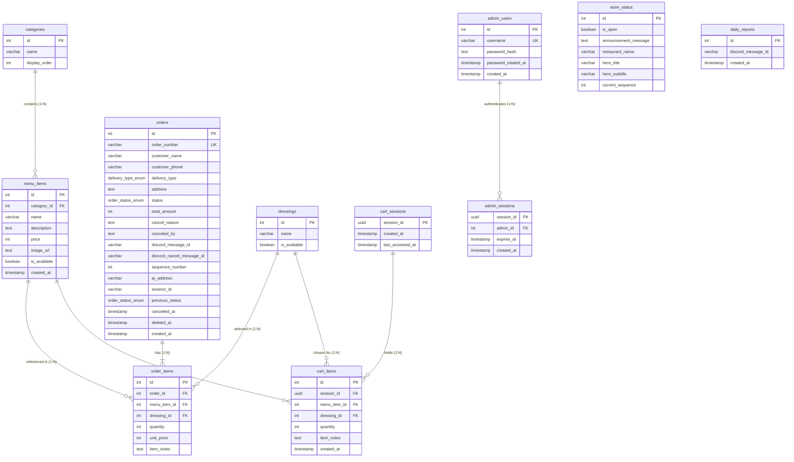

<div align="center">
  <h1>🗄️ Database Architecture & Schema</h1>
  <p><strong>PostgreSQL 17+ database architecture designed with Relational Integrity, Custom ENUMs, Foreign Key Cascades, B-Tree Indexes optimized for High-Frequency Polling, and seamless Auto-Migration.</strong></p>
</div>

---

## 📊 Entity-Relationship Diagram (ERD)



---

## 📑 Tables & Columns Specification

### 1. `categories` (Food Categories)
* `id` (`SERIAL PRIMARY KEY`): Unique category identifier
* `name` (`VARCHAR(100) NOT NULL`): Category name (e.g., *Spring Rolls*, *Avocado Spring Rolls*)
* `display_order` (`INT DEFAULT 0`): Display ordering priority on the storefront

### 2. `menu_items` (Menu Catalog)
* `id` (`SERIAL PRIMARY KEY`): Unique menu item identifier
* `category_id` (`INT REFERENCES categories(id) ON DELETE SET NULL`): Parent category reference
* `name` (`VARCHAR(150) NOT NULL`): Menu item title (e.g., *Salmon Spring Roll*)
* `description` (`TEXT`): Detailed item description
* `price` (`INT NOT NULL`): Selling price (in THB)
* `image_url` (`TEXT`): Emoji icon or full image URL
* `is_available` (`BOOLEAN DEFAULT TRUE`): Availability switch for storefront ordering
* `created_at` (`TIMESTAMP WITH TIME ZONE DEFAULT CURRENT_TIMESTAMP`): Record creation timestamp

### 3. `dressings` (Salad Dressing Options)
* `id` (`SERIAL PRIMARY KEY`): Unique dressing identifier (`0` = No dressing selected)
* `name` (`VARCHAR(100) NOT NULL`): Dressing title (e.g., *Seafood Cream Dressing*)
* `is_available` (`BOOLEAN DEFAULT TRUE`): Availability switch for dressing options

### 4. `orders` (Customer Orders)
* `id` (`SERIAL PRIMARY KEY`): Internal database order ID
* `order_number` (`VARCHAR(50) UNIQUE NOT NULL`): Customer-facing order code (`ORD-YYYYMMDD-XXX`)
* `customer_name` (`VARCHAR(100) NOT NULL`): Customer's name (up to 50 characters)
* `customer_phone` (`VARCHAR(20) NOT NULL`): Contact phone number (9–10 digits)
* `delivery_type` (`delivery_type_enum NOT NULL`): Order type (`'รับเองที่ร้าน'` for pickup, `'จัดส่ง'` for delivery)
* `address` (`TEXT`): Delivery address (mandatory for delivery orders)
* `status` (`order_status_enum NOT NULL DEFAULT 'รอดำเนินการ'`): Current order state
* `total_amount` (`INT NOT NULL`): Total bill amount (in THB)
* `cancel_reason` (`TEXT DEFAULT NULL`): Cancellation explanation (1–20 characters)
* `canceled_by` (`TEXT DEFAULT NULL`): Cancellation party (`'ลูกค้า'` for customer / `'ร้านค้า'` for store)
* `discord_message_id` (`VARCHAR(255) DEFAULT NULL`): Notification message ID in Discord
* `discord_cancel_message_id` (`VARCHAR(255) DEFAULT NULL`): Cancellation notification message ID
* `sequence_number` (`INT NOT NULL`): Daily queue sequence number (1, 2, 3...)
* `ip_address` (`VARCHAR(45) DEFAULT NULL`): Customer IP address
* `session_id` (`VARCHAR(255) DEFAULT NULL`): Cart session ID for authorization verification
* `previous_status` (`order_status_enum DEFAULT NULL`): Order state prior to cancellation
* `cancelled_at` (`TIMESTAMP WITH TIME ZONE DEFAULT NULL`): Cancellation timestamp
* `deleted_at` (`TIMESTAMP WITH TIME ZONE DEFAULT NULL`): Soft delete timestamp
* `created_at` (`TIMESTAMP WITH TIME ZONE DEFAULT CURRENT_TIMESTAMP`): Order creation timestamp

### 5. `order_items` (Order Line Items)
* `id` (`SERIAL PRIMARY KEY`): Line item identifier
* `order_id` (`INT REFERENCES orders(id) ON DELETE CASCADE`): Parent order reference
* `menu_item_id` (`INT REFERENCES menu_items(id) ON DELETE CASCADE`): Ordered menu item
* `quantity` (`INT NOT NULL CHECK (quantity > 0)`): Quantity ordered
* `unit_price` (`INT NOT NULL`): Locked unit price at the time of purchase
* `dressing_id` (`INT REFERENCES dressings(id) ON DELETE SET NULL`): Selected dressing option
* `item_notes` (`TEXT`): Special cooking/customization notes

### 6. `store_status` (Store Configuration & Queue)
* `id` (`SERIAL PRIMARY KEY`): Single singleton row (`id = 1`)
* `is_open` (`BOOLEAN DEFAULT TRUE`): Master toggle for accepting new orders
* `announcement_message` (`TEXT DEFAULT ''`): Live storefront banner message
* `restaurant_name` (`VARCHAR(100) DEFAULT 'ร้านสปริงโรลออนไลน์'`): Store display name
* `hero_title` (`VARCHAR(150) DEFAULT '🥗 เมนูเพื่อสุขภาพสดใหม่'`): Hero banner title
* `hero_subtitle` (`VARCHAR(255) DEFAULT 'ผักสดกรอบ สะอาด อร่อยเต็มคำ — ทำสดใหม่ทุกออเดอร์'`): Hero banner subtitle
* `current_sequence` (`INT DEFAULT 0`): Last allocated daily queue sequence number

### 7. `admin_users` (Administrator Credentials)
* `id` (`SERIAL PRIMARY KEY`): Administrator record ID
* `username` (`VARCHAR(50) UNIQUE NOT NULL`): Admin login username
* `password_hash` (`TEXT NOT NULL`): bcrypt encrypted password hash (Salt Rounds: 12)
* `password_rotated_at` (`TIMESTAMP WITH TIME ZONE DEFAULT NULL`): Last password update timestamp
* `created_at` (`TIMESTAMP WITH TIME ZONE DEFAULT CURRENT_TIMESTAMP`): Account creation timestamp

### 8. `admin_sessions` (Admin Session Tokens)
* `session_id` (`UUID PRIMARY KEY`): UUIDv4 session identifier
* `admin_id` (`INT REFERENCES admin_users(id) ON DELETE CASCADE`): Associated admin user
* `expires_at` (`TIMESTAMP WITH TIME ZONE NOT NULL`): Expiration timestamp (24-hour TTL)
* `created_at` (`TIMESTAMP WITH TIME ZONE DEFAULT CURRENT_TIMESTAMP`): Session creation timestamp

### 9. `cart_sessions` (Customer Guest Sessions)
* `session_id` (`UUID PRIMARY KEY`): UUIDv4 guest cart identifier
* `created_at` (`TIMESTAMP WITH TIME ZONE DEFAULT CURRENT_TIMESTAMP`): Session creation timestamp
* `last_accessed_at` (`TIMESTAMP WITH TIME ZONE DEFAULT CURRENT_TIMESTAMP`): Last activity timestamp

### 10. `cart_items` (Shopping Cart Items)
* `id` (`SERIAL PRIMARY KEY`): Cart item identifier
* `session_id` (`UUID REFERENCES cart_sessions(session_id) ON DELETE CASCADE`): Parent cart session
* `menu_item_id` (`INT REFERENCES menu_items(id) ON DELETE CASCADE`): Targeted menu item
* `dressing_id` (`INT REFERENCES dressings(id) ON DELETE SET NULL`): Selected dressing option
* `quantity` (`INT NOT NULL DEFAULT 1 CHECK (quantity > 0)`): Item quantity
* `item_notes` (`TEXT`): Item customization notes
* `created_at` (`TIMESTAMP WITH TIME ZONE DEFAULT CURRENT_TIMESTAMP`): Added timestamp

### 11. `daily_reports` (Discord Report History)
* `id` (`SERIAL PRIMARY KEY`): Report log identifier
* `discord_message_id` (`VARCHAR(255) NOT NULL`): Message ID in Discord reports channel
* `created_at` (`TIMESTAMP WITH TIME ZONE DEFAULT CURRENT_TIMESTAMP`): Report dispatch timestamp

---

## 🔒 Foreign Key Cascades & Actions

| Child Table | Foreign Key Column | Parent Table | ON DELETE Action |
|---|---|---|---|
| `menu_items` | `category_id` | `categories(id)` | `SET NULL` (Preserves menu item, detaches category) |
| `order_items` | `order_id` | `orders(id)` | `CASCADE` (Deletes line items when order is purged) |
| `order_items` | `menu_item_id` | `menu_items(id)` | `CASCADE` *(Guarded at application layer)* |
| `order_items` | `dressing_id` | `dressings(id)` | `SET NULL` (Preserves line item, detaches dressing) |
| `cart_items` | `session_id` | `cart_sessions(session_id)` | `CASCADE` (Purges items when cart session expires) |
| `cart_items` | `menu_item_id` | `menu_items(id)` | `CASCADE` (Removes item automatically from carts) |
| `cart_items` | `dressing_id` | `dressings(id)` | `SET NULL` |
| `admin_sessions` | `admin_id` | `admin_users(id)` | `CASCADE` (Invalidates sessions when user is deleted) |

---

## 🔒 Custom PostgreSQL ENUMs

1. **`delivery_type_enum`**
   * `'รับเองที่ร้าน'`: Store pickup by customer
   * `'จัดส่ง'`: Home/office delivery to customer address

2. **`order_status_enum`**
   * `'รอดำเนินการ'`: Pending order awaiting restaurant confirmation
   * `'รับออเดอร์แล้ว'`: Order confirmed and queue allocated
   * `'กำลังเตรียมอาหาร'`: Kitchen preparing fresh food
   * `'พร้อมรับอาหาร'`: Ready for customer pickup (Store Pickup workflow)
   * `'รับอาหารแล้ว'`: Order collected by customer (Terminal state for Pickup)
   * `'กำลังจัดส่ง'`: Order picked up by driver (Delivery workflow)
   * `'จัดส่งแล้ว'`: Order delivered to destination (Terminal state for Delivery)
   * `'ยกเลิก'`: Order cancelled by customer or restaurant

---

## ⚡ B-Tree Indexes for Smart Polling Optimization

Engineered specifically to support high-frequency polling (4s) and transactional workload efficiency:

```sql
-- 1. Accelerates admin status filtering (Admin Polling 4s)
CREATE INDEX IF NOT EXISTS idx_orders_status ON orders(status);

-- 2. Optimizes chronological order sorting (ORDER BY created_at DESC)
CREATE INDEX IF NOT EXISTS idx_orders_created_at ON orders(created_at DESC);

-- 3. Enables instant soft-delete verification
CREATE INDEX IF NOT EXISTS idx_orders_deleted_at ON orders(deleted_at);

-- 4. Speeds up line item JOIN operations for active orders
CREATE INDEX IF NOT EXISTS idx_order_items_order_id ON order_items(order_id);

-- 5. Accelerates automated cleanup of inactive guest carts
CREATE INDEX IF NOT EXISTS idx_cart_sessions_last_active ON cart_sessions(last_accessed_at);

-- 6. Accelerates automated cleanup of expired admin sessions
CREATE INDEX IF NOT EXISTS idx_admin_sessions_expires_at ON admin_sessions(expires_at);

-- 7. Composite Index for status filtering with chronological sorting (Kitchen Kanban Polling core)
CREATE INDEX IF NOT EXISTS idx_orders_status_created ON orders(status, created_at DESC);

-- 8. Partial Index for non-deleted session order tracking (Customer Auto-Track Polling)
CREATE INDEX IF NOT EXISTS idx_orders_session_active ON orders(session_id) WHERE deleted_at IS NULL;

-- 9. Composite Index preventing full table scans on item lookups
CREATE INDEX IF NOT EXISTS idx_order_items_composite ON order_items(order_id, menu_item_id);
```

---

## 🌱 Default Seed Data

1. **Categories (`categories`)**:
   * `1`: Spring Rolls (`display_order: 1`)
   * `2`: Avocado Spring Rolls (`display_order: 2`)

2. **Menu Catalog (`menu_items` - 8 Items)**:
   * `1`: Salmon Spring Roll (🐟, 40 THB)
   * `2`: Avocado & Salmon Spring Roll (🐟🥑, 40 THB)
   * `3`: Shrimp Spring Roll (🦐, 35 THB)
   * `4`: Avocado & Shrimp Spring Roll (🦐🥑, 35 THB)
   * `5`: Chicken Breast Spring Roll (🐣, 35 THB)
   * `6`: Avocado & Chicken Breast Spring Roll (🐣🥑, 35 THB)
   * `7`: Crab Stick Spring Roll (🦀, 35 THB)
   * `8`: Avocado & Crab Stick Spring Roll (🦀🥑, 35 THB)

3. **Salad Dressings (`dressings` - 5 Choices)**:
   * `0`: No Dressing (Default fallback option)
   * `1`: Cream Salad Dressing
   * `2`: Seafood Cream Dressing
   * `3`: Caesar Dressing
   * `4`: Thousand Island Dressing

4. **Store Configuration (`store_status`)**:
   * `is_open: true`, `announcement_message: 'Open and ready for orders! 💖'`, `restaurant_name: 'Spring Roll Online Store'`

---

## 🚀 Database Management & Auto-Migration

1. **Auto-Migration (`backend/server.js`)**:
   * Validates database connection on server bootstrap (`SELECT NOW()`).
   * Automatically executes [schema.sql](schema.sql) if tables do not exist, setting up tables, custom ENUMs, foreign keys, B-Tree indexes, seed data, and updating sequence offsets (`setval`).
   * Initializes/updates the default `admin` credentials from `.env`.

2. **Manual Execution via Docker / psql**:
   ```bash
   docker compose exec db psql -U springroll -d springroll_db -f /docker-entrypoint-initdb.d/schema.sql
   ```
