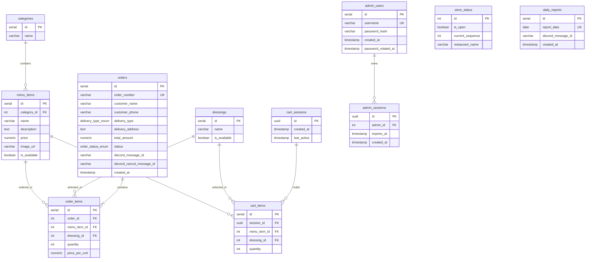

  <h1>🗄️ Database Schema & Architecture - ร้านสปริงโรลออนไลน์</h1>
  
โครงสร้างฐานข้อมูล <strong>PostgreSQL</strong> ออกแบบตามหลัก Relational Integrity พร้อมการใช้ <strong>Custom ENUMs, Constraints, Cascades</strong> และ Indexes สำหรับ High-Performance Queries

---

## 🏗️ โครงสร้างตารางและความสัมพันธ์ (Schema Design)

---

## 🛡️ กลไกความสมบูรณ์ของข้อมูล (Data Integrity & Optimization)

1. **Type-Safety ด้วย `ENUM`**
   - `delivery_type_enum`: `'รับเองที่ร้าน'`, `'จัดส่ง'`
   - `order_status_enum`: `'รอดำเนินการ'`, `'รับออเดอร์แล้ว'`, `'กำลังเตรียมอาหาร'`, `'พร้อมรับอาหาร'`, `'รับอาหารแล้ว'`, `'กำลังจัดส่ง'`, `'จัดส่งแล้ว'`, `'ยกเลิก'`
   - ป้องกัน Application Layer บันทึกค่าสถานะที่ไม่ถูกต้องลงฐานข้อมูล
2. **Composite Unique Constraint บน `cart_items`**
   - คำสั่ง `UNIQUE(session_id, menu_item_id, dressing_id)` ป้องกันการแทรกแถวซ้ำซ้อน และบังคับให้อัปเดตจำนวนสินค้า (`quantity`) แทนการสร้างรายการใหม่
3. **Foreign Key Constraints & Cascading Deletes**
   - ความสัมพันธ์ระหว่าง `orders` และ `order_items` ใช้ `ON DELETE CASCADE` ช่วยทำความสะอาดข้อมูลรายการอาหารเมื่อออเดอร์ถูกลบ
4. **Optimized Indexes**
   - `idx_orders_status` บน `orders(status)` เพื่อเร่งความเร็วในการ Filter ออเดอร์ของหน้าจัดการแอดมิน
   - `idx_orders_created_at` บน `orders(created_at)` สำหรับการจัดเรียงออเดอร์ล่าสุด
   - `idx_order_items_order_id` เพื่อความรวดเร็วในการทำ JOIN ตารางรายการอาหาร
   - `idx_cart_sessions_last_active` และ `idx_admin_sessions_expires_at` ช่วยให้คำสั่ง Cron Maintenance ลบ Session เก่าได้อย่างรวดเร็ว

---

## 🚀 ความเข้ากันได้กับ Neon Serverless PostgreSQL

สคริปต์ `database/schema.sql` และคำสั่งใน `backend/server.js` สามารถนำไปรันบน **Neon.tech** ได้ทันที:
- รองรับ SSL Connection (`sslmode=require`)
- รองรับ Connection Pooling (PgBouncer)
- มี Seed Data พื้นฐาน (Admin user, หมวดหมู่, เมนูอาหาร, และรายการน้ำสลัด) พร้อมใช้งานทันที
