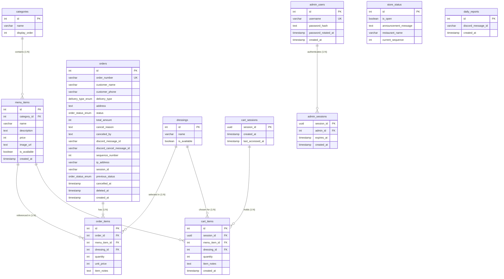

<div align="center">
  <h1>🗄️ โครงสร้างฐานข้อมูล (Database Architecture & Schema)</h1>
  <p><strong>ระบบฐานข้อมูล PostgreSQL 15+ ออกแบบตามหลัก Relational Integrity, Custom ENUMs, Foreign Key Cascades และ B-Tree Indexes ประสิทธิภาพสูง รองรับทั้งการรันบน Local Docker และผู้ให้บริการ Cloud Database Hosting ทุกค่าย</strong></p>
</div>

---

## 📊 แผนภาพความสัมพันธ์ของข้อมูล (Entity-Relationship Diagram)



---

## 📑 รายละเอียดโครงสร้างตารางทั้งหมด (Tables & Columns Specification)

### 1. ตาราง `categories` (หมวดหมู่อาหาร)
เก็บข้อมูลหมวดหมู่เพื่อจัดกลุ่มเมนูอาหารบนหน้าร้านและหน้าแอดมิน
* `id` (`SERIAL PRIMARY KEY`): รหัสหมวดหมู่
* `name` (`VARCHAR(100) NOT NULL`): ชื่อหมวดหมู่ (เช่น *สปริงโรล*, *สปริงโรลอโวคาโด้*)
* `display_order` (`INT DEFAULT 0`): ลำดับการแสดงผล

### 2. ตาราง `menu_items` (รายการเมนูอาหาร)
เก็บข้อมูลอาหาร ราคา รูปภาพ และสถานะความพร้อมจำหน่าย
* `id` (`SERIAL PRIMARY KEY`): รหัสเมนู
* `category_id` (`INT REFERENCES categories(id) ON DELETE SET NULL`): หมวดหมู่อาหาร
* `name` (`VARCHAR(150) NOT NULL`): ชื่อเมนูอาหาร (เช่น *สปริงโรลแซลม่อน*)
* `description` (`TEXT`): รายละเอียดเมนู
* `price` (`INT NOT NULL`): ราคาจำหน่าย (บาท)
* `image_url` (`TEXT`): ไอคอนอีโมจิหรือ URL รูปภาพ
* `is_available` (`BOOLEAN DEFAULT TRUE`): สถานะเปิด/ปิดจำหน่ายเมนูนี้
* `created_at` (`TIMESTAMP WITH TIME ZONE DEFAULT CURRENT_TIMESTAMP`): เวลาที่สร้าง

### 3. ตาราง `dressings` (รายการน้ำสลัด)
เก็บข้อมูลน้ำสลัดสำหรับให้ลูกค้าเลือกจับคู่กับเมนู
* `id` (`SERIAL PRIMARY KEY`): รหัสน้ำสลัด (`0` = ไม่รับน้ำสลัด)
* `name` (`VARCHAR(100) NOT NULL`): ชือน้ำสลัด (เช่น *สลัดครีมซีฟู๊ด*, *ซีซาร์สลัด*)
* `is_available` (`BOOLEAN DEFAULT TRUE`): สถานะพร้อมให้บริการ

### 4. ตาราง `orders` (คำสั่งซื้อของลูกค้า)
ตารางหลักสำหรับเก็บข้อมูลคำสั่งซื้อ ข้อมูลผู้รับ และสถานะ
* `id` (`SERIAL PRIMARY KEY`): รหัสออเดอร์ในระบบ
* `order_number` (`VARCHAR(50) UNIQUE NOT NULL`): รหัสคำสั่งซื้อที่แสดงให้ลูกค้า (เช่น `ORD-20260818-0001` หรือ `SR-260818-001`)
* `customer_name` (`VARCHAR(100) NOT NULL`): ชื่อลูกค้า
* `customer_phone` (`VARCHAR(20) NOT NULL`): เบอร์โทรศัพท์ลูกค้า
* `delivery_type` (`delivery_type_enum NOT NULL`): รูปแบบการรับอาหาร (`รับเองที่ร้าน` หรือ `จัดส่ง`)
* `address` (`TEXT`): ที่อยู่จัดส่ง (เป็นค่าว่างหากลูกค้ารับเองที่ร้าน)
* `status` (`order_status_enum NOT NULL DEFAULT 'รอดำเนินการ'`): สถานะคำสั่งซื้อปัจจุบัน
* `total_amount` (`INT NOT NULL`): ยอดเงินรวมทั้งสิ้น (บาท)
* `cancel_reason` (`TEXT DEFAULT NULL`): เหตุผลการยกเลิกออเดอร์
* `canceled_by` (`TEXT DEFAULT NULL`): ผู้ที่ทำการยกเลิก (`ลูกค้า` หรือ `ร้านค้า`)
* `discord_message_id` (`VARCHAR(255) DEFAULT NULL`): Message ID ของการแจ้งเตือนใน Discord
* `discord_cancel_message_id` (`VARCHAR(255) DEFAULT NULL`): Message ID ของการแจ้งเตือนยกเลิก
* `sequence_number` (`INT NOT NULL`): ลำดับคิวประจำวัน (เริ่มต้นที่ 1 ในแต่ละวัน)
* `ip_address` (`VARCHAR(45) DEFAULT NULL`): IP Address ของลูกค้าเพื่อความปลอดภัย
* `session_id` (`VARCHAR(255) DEFAULT NULL`): Cart Session ID ของลูกค้า
* `previous_status` (`order_status_enum DEFAULT NULL`): สถานะก่อนหน้าก่อนถูกยกเลิก
* `cancelled_at` (`TIMESTAMP WITH TIME ZONE DEFAULT NULL`): เวลาที่ยกเลิก
* `deleted_at` (`TIMESTAMP WITH TIME ZONE DEFAULT NULL`): เวลาที่ Soft Delete
* `created_at` (`TIMESTAMP WITH TIME ZONE DEFAULT CURRENT_TIMESTAMP`): เวลาที่สั่งซื้อ

### 5. ตาราง `order_items` (รายการอาหารในคำสั่งซื้อ)
เก็บรายละเอียดอาหารแต่ละจานในออเดอร์
* `id` (`SERIAL PRIMARY KEY`): รหัสรายการ
* `order_id` (`INT REFERENCES orders(id) ON DELETE CASCADE`): รหัสออเดอร์
* `menu_item_id` (`INT REFERENCES menu_items(id) ON DELETE CASCADE`): รหัสเมนู
* `quantity` (`INT NOT NULL CHECK (quantity > 0)`): จำนวนชิ้น
* `unit_price` (`INT NOT NULL`): ราคาต่อหน่วย ณ เวลาที่สั่ง
* `dressing_id` (`INT REFERENCES dressings(id) ON DELETE SET NULL`): รหัสน้ำสลัดที่เลือก
* `item_notes` (`TEXT`): หมายเหตุพิเศษ (เช่น ไม่ใส่ผักชี, แยกน้ำสลัด)

### 6. ตาราง `store_status` (สถานะร้านค้าและลำดับคิว)
เก็บการตั้งค่าสถานะร้านค้าส่วนกลาง (Single Row Table: `id = 1`)
* `id` (`SERIAL PRIMARY KEY`): รหัสแถว (`1`)
* `is_open` (`BOOLEAN DEFAULT TRUE`): สถานะเปิด/ปิดรับออเดอร์ของร้าน
* `announcement_message` (`TEXT DEFAULT ''`): ข้อความประกาศหน้าร้าน
* `restaurant_name` (`VARCHAR(100) DEFAULT 'ร้านสปริงโรลออนไลน์'`): ชื่อร้านค้า
* `current_sequence` (`INT DEFAULT 0`): ลำดับคิวล่าสุดประจำวัน

### 7. ตาราง `admin_users` (บัญชีผู้ดูแลระบบ)
เก็บข้อมูลบัญชีผู้ใช้งานระบบแอดมินหลังบ้าน
* `id` (`SERIAL PRIMARY KEY`): รหัสผู้ดูแลระบบ
* `username` (`VARCHAR(50) UNIQUE NOT NULL`): ชื่อผู้ใช้งาน
* `password_hash` (`TEXT NOT NULL`): รหัสผ่านที่เข้ารหัสด้วย bcrypt
* `password_rotated_at` (`TIMESTAMP WITH TIME ZONE DEFAULT NULL`): เวลาที่มีการเปลี่ยนรหัสผ่านล่าสุด
* `created_at` (`TIMESTAMP WITH TIME ZONE DEFAULT CURRENT_TIMESTAMP`): เวลาที่สร้างบัญชี

### 8. ตาราง `admin_sessions` (เซสชันการเข้าสู่ระบบของแอดมิน)
เก็บบันทึกเซสชัน Token สำหรับตรวจสอบสิทธิ์แอดมิน
* `session_id` (`UUID PRIMARY KEY`): รหัสเซสชันแบบ UUIDv4
* `admin_id` (`INT REFERENCES admin_users(id) ON DELETE CASCADE`): รหัสแอดมินเจ้าของเซสชัน
* `expires_at` (`TIMESTAMP WITH TIME ZONE NOT NULL`): เวลาที่เซสชันหมดอายุ (ค่าเริ่มต้น 24 ชั่วโมง)
* `created_at` (`TIMESTAMP WITH TIME ZONE DEFAULT CURRENT_TIMESTAMP`): เวลาที่สร้าง

### 9. ตาราง `cart_sessions` (เซสชันตะกร้าสินค้าของลูกค้า)
เก็บบันทึกเซสชันตะกร้าสินค้าของลูกค้าแต่ละราย
* `session_id` (`UUID PRIMARY KEY`): รหัสเซสชันตะกร้าสินค้าแบบ UUIDv4
* `created_at` (`TIMESTAMP WITH TIME ZONE DEFAULT CURRENT_TIMESTAMP`): เวลาที่สร้างตะกร้า
* `last_accessed_at` (`TIMESTAMP WITH TIME ZONE DEFAULT CURRENT_TIMESTAMP`): เวลาที่มีการใช้งานล่าสุด

### 10. ตาราง `cart_items` (รายการสินค้าในตะกร้า)
เก็บรายการอาหารที่ลูกค้าหยิบใส่ตะกร้าไว้
* `id` (`SERIAL PRIMARY KEY`): รหัสรายการในตะกร้า
* `session_id` (`UUID REFERENCES cart_sessions(session_id) ON DELETE CASCADE`): รหัสเซสชันตะกร้า
* `menu_item_id` (`INT REFERENCES menu_items(id) ON DELETE CASCADE`): รหัสเมนู
* `dressing_id` (`INT REFERENCES dressings(id) ON DELETE SET NULL`): รหัสน้ำสลัด
* `quantity` (`INT NOT NULL DEFAULT 1`): จำนวนชิ้น
* `item_notes` (`TEXT`): หมายเหตุรายการ
* `created_at` (`TIMESTAMP WITH TIME ZONE DEFAULT CURRENT_TIMESTAMP`): เวลาที่เพิ่มลงตะกร้า

### 11. ตาราง `daily_reports` (ประวัติการส่งรายงานสรุปยอดเข้า Discord)
เก็บบันทึกประวัติการส่งสรุปยอดขายประจำวัน
* `id` (`SERIAL PRIMARY KEY`): รหัสบันทึกรายงาน
* `discord_message_id` (`VARCHAR(255) NOT NULL`): Message ID ของข้อความรายงานใน Discord
* `created_at` (`TIMESTAMP WITH TIME ZONE DEFAULT CURRENT_TIMESTAMP`): เวลาที่ส่งรายงาน

---

## 🔒 ชนิดข้อมูลแบบกำหนดเอง (Custom PostgreSQL ENUMs)

1. **`delivery_type_enum`**
   - `'รับเองที่ร้าน'`: ลูกค้าเลือกรับสินค้าที่หน้าร้าน
   - `'จัดส่ง'`: ลูกค้าเลือกบริการเดลิเวอรี่ตามที่อยู่

2. **`order_status_enum`**
   - `'รอดำเนินการ'`: ออเดอร์เข้าใหม่ รอทางร้านกดยืนยันรับคิว
   - `'รับออเดอร์แล้ว'`: ทางร้านยืนยันคิวเรียบร้อย
   - `'กำลังเตรียมอาหาร'`: ครัวกำลังปรุงอาหารสดใหม่
   - `'พร้อมรับอาหาร'`: อาหารปรุงเสร็จแล้ว พร้อมให้ลูกค้ามารับที่หน้าร้าน
   - `'รับอาหารแล้ว'`: ลูกค้ารับอาหารที่หน้าร้านเรียบร้อยแล้ว
   - `'กำลังจัดส่ง'`: ไรเดอร์กำลังนำอาหารไปส่งตามที่อยู่
   - `'จัดส่งแล้ว'`: ส่งอาหารถึงมือลูกค้าเรียบร้อยแล้ว
   - `'ยกเลิก'`: ออเดอร์ถูกยกเลิก (โดยลูกค้าหรือทางร้าน)

---

## ⚡ ดัชนีและการเพิ่มประสิทธิภาพการคิวรี่ (B-Tree Indexes)

```sql
-- 1. ค้นหาและกรองสถานะออเดอร์ในหน้าแอดมินได้ทันที
CREATE INDEX IF NOT EXISTS idx_orders_status ON orders(status);

-- 2. เรียงลำดับออเดอร์ล่าสุดได้รวดเร็ว (ORDER BY created_at DESC)
CREATE INDEX IF NOT EXISTS idx_orders_created_at ON orders(created_at DESC);

-- 3. ตรวจสอบสถานะ Soft Delete ได้อย่างรวดเร็ว
CREATE INDEX IF NOT EXISTS idx_orders_deleted_at ON orders(deleted_at);

-- 4. เร่งความเร็วการ JOIN รายการอาหารในออเดอร์
CREATE INDEX IF NOT EXISTS idx_order_items_order_id ON order_items(order_id);

-- 5. เร่งความเร็วให้ Cron Job ล้างตะกร้าสินค้าที่ไม่ได้ใช้งานนานเกินกำหนด
CREATE INDEX IF NOT EXISTS idx_cart_sessions_last_active ON cart_sessions(last_accessed_at);

-- 6. เร่งความเร็วให้ Cron Job ล้างเซสชันแอดมินที่หมดอายุ
CREATE INDEX IF NOT EXISTS idx_admin_sessions_expires_at ON admin_sessions(expires_at);

-- 7. Composite Index กรองสถานะพร้อมเรียงลำดับเวลา
CREATE INDEX IF NOT EXISTS idx_orders_status_created ON orders(status, created_at DESC);

-- 8. Partial Index กรองออเดอร์ของเซสชันที่ยังไม่ถูกลบ
CREATE INDEX IF NOT EXISTS idx_orders_session_active ON orders(session_id) WHERE deleted_at IS NULL;

-- 9. Composite Index ป้องกันการสแกนตารางแบบ Full Scan เมื่อ JOIN
CREATE INDEX IF NOT EXISTS idx_order_items_composite ON order_items(order_id, menu_item_id);
```

---

## 🚀 การรันระบบฐานข้อมูลและการ Migrate อัตโนมัติ (Auto-Migration)

1. **ระบบเริ่มทำงานอัตโนมัติ (`backend/server.js`)**:
   - เมื่อเซิร์ฟเวอร์ Backend บูตขึ้นมา ระบบจะทดสอบการเชื่อมต่อฐานข้อมูล (`SELECT NOW()`)
   - รันสคริปต์ `database/schema.sql` อัตโนมัติ เพื่อสร้างตาราง, ENUMs, Indexes และ Seed Data ทันทีหากยังไม่มี
   - สร้างและอัปเดตรหัสผ่านเริ่มต้นของผู้ใช้ `admin` ตามค่า `ADMIN_INIT_PASSWORD` ใน `.env`

2. **การรันแบบแมนนวลผ่าน Docker / psql**:
   ```bash
   # เข้าสู่ Container PostgreSQL ในเครื่อง
   docker compose exec db psql -U springroll -d springroll_db -f /docker-entrypoint-initdb.d/schema.sql
   ```
